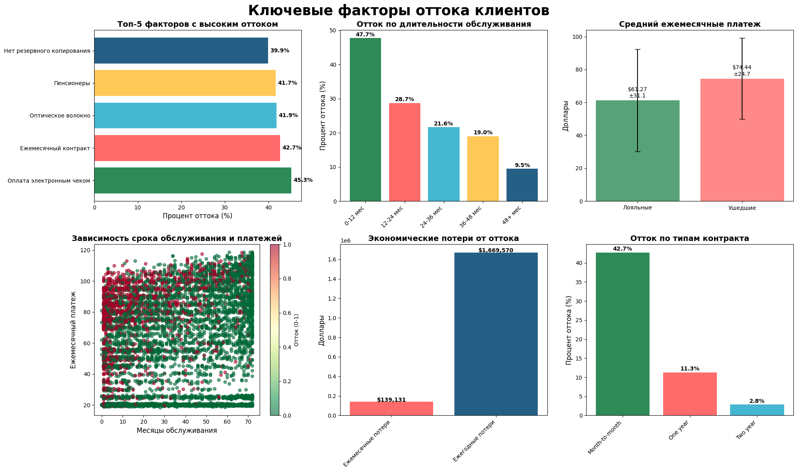

# Проекты по подготовке, анализу и визуализации данных с использованием Python

## 1. Анализ A/B теста: Эффективность новой стратегии на лендинге
[Ссылка на проект](https://github.com/sasergeevna/python_projects.github.io/blob/main/AB_test_project.ipynb)

### Основная цель проекта:
**Проверить статистическую значимость различий в конверсии между тестовой и контрольной группами для принятия решения о внедрении изменений;**
### Бизнес-задача: 
**Тестирование нового дизайна лендинга для увеличения конверсии;**

### Инструменты:
    

### Выводы 

- Тестовая группа показала статистически значимое улучшение конверсии на 14.99% по сравнению с контрольной группой;
- Оба статистических теста (биномиальный и t-тест) показали чрезвычайно низкие p-values (6.51e-35 и 1.41e-11), что указывает на высокую надежность результатов;
- Результат значим на любом уровне значимости;
- Распределения близки к нормальным, что допускает использование параметрических тестов;
- На 10,000 пользователей: +160 дополнительных конверсий;

### Рекомендации:
-  Внедрить изменения тестовой группы на всех пользователей;
-  Мониторить ключевые метрики в течение 2 недель после внедрения;
-  Провести дополнительный анализ сегментов пользователей;

## 2. Анализ оттока клиентов телеком-компании и поиск факторов удержания
[Ссылка на проект](https://github.com/sasergeevna/python_projects.github.io/blob/main/Telecom_Customer_Churn_Analysis.ipynb)
### Основная задача проекта:
**Определить ключевые факторы, влияющие на отток клиентов**

### Цели:
- Провести продуктовую сегментацию и выявить группы с наибольшим риском;
- Построить воронку удержания и выявить критические периоды ухода;
- Оценить экономические потери от оттока (ARPU, LTV);
- Сформулировать бизнес-рекомендации для снижения оттока и увеличения выручки;

### Инструменты:
   

### Выводы 
Ключевые факторы оттока:
- Контракт на один месяц (+42.7% оттока клиентов);
- Оплата Электронными чеками  (+45.3%);
- Проведенное оптическое волокно без доп. сервисов (+55%);
- Высокая ежемесячная оплата (средняя у ушедших $74 и $61 у лояльных);
Воронка удержания:
- Наибольший отток в первые 3–6 месяцев (59% и 47%);
- После 2 лет клиенты становятся гораздо стабильнее (отток < 20%);
- 20% всего оттока приходится на 1-й месяц;
Бизнес-рекомендации:
- Удержание новых клиентов: создать welcome-программу (скидки, бонусы в первый год);
- Изменение методов оплаты: стимулировать переход с Electronic check на автосписания;

  

## 3. Анализ факторов выживаемости на Титанике
[Ссылка на проект](https://github.com/sasergeevna/python_projects.github.io/blob/main/Titanic_project.ipynb) 
### Основная задача проекта:
**Анализ факторов выживаемости для улучшения протоколов безопасности.**

### Цели:
- Выявить ключевые демографические факторы, влияющие на выживаемость;
- Проанализировать эффективность принципа "сначала женщины и дети";
- Предложить рекомендации для будущих систем безопасности;

### Инструменты:
   

### Выводы и рекомендации

- **Демографические факторы**: Пол и возраст - ключевые факторы выживаемости;
- **Эффективность эвакуации**: Принцип "сначала женщины и дети" работал эффективно;
- **Рекомендации**:
   - Усилить подготовку экипажа для работы с пассажирами, путешествующими в одиночку;
   - Разработать специальные протоколы для помощи мужчинам-пассажирам;
   - Учесть возрастные особенности при планировании эвакуации;
- **Наличие статистической значимости подтверждает, что выявленные закономерности не случайны и могут использоваться для разработки протоколов систем безопасности.**

<!-- Proudly created with GPRM ( https://gprm.itsvg.in ) -->
